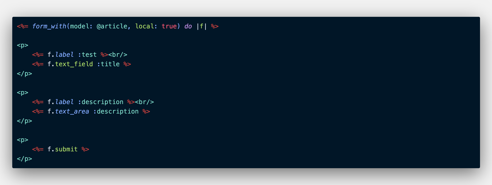
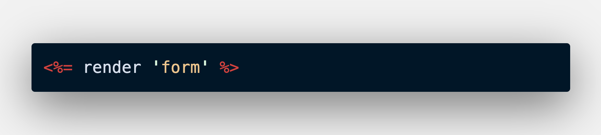

Partials in Ruby on Rails keeps from writing the same code over and over again in your views. If you had a new blog post form and an edit blog post form, they're more than likely are going to have the same fields. Instead rewriting the form or copy and pasting you can use partial for the views.

**To put it simply a partials are views you call inside of other views**(viewception)

To create a view the first you need yo done is create a new file that name starts with an underscore(_).

```ruby
_form.html.erb
```
The underscore is the what show Rails it's a partial as well as any other devs who may look at your code.

In your new **_form.html.erb** file type the [embedded Ruby](https://williamjohnson.dev/what-is-embedded-ruby) you want to reuse in different views.



Once you have the code you want go to a file you want to use the code in for this we'll say new.html.erb and edit.html.erb.

To show your new partial in the views you want. Type the word **render** and the name of the partial we're using **form** inside of single quotes. Notice how when you go to render the partial you don't have to include the underscore.



BOOM! Dino-DNA. 

This a great feature in Rails to help keep your code clean and easy to navigate.


